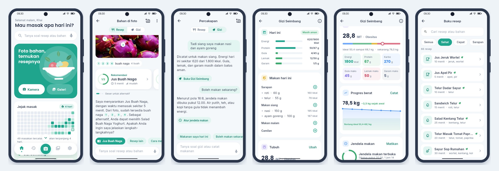

# App architecture

[Bahasa Indonesia](../id/arsitektur.md)

The app is written in Flutter for Android. Every model runs on the phone: the ingredient detector and OCR through
ONNX Runtime, the language model through llama.cpp's `llama-server` started as a local process, and Whisper through
sherpa-onnx.

## Code layout

```
lib/
  main.dart            entry point; opening animation, model setup, nickname, then home
  app_state.dart       app state: settings, models, sessions, history, photo preparation for the models
  core/
    pipeline.dart      one turn: photo, markers, request parsing, answer selection
    grounding.dart     markers: duplicate removal, numbering, counting units
    recipes.dart       recipe book, ranking, request rules
    vocab.dart         ingredient and package brand vocabulary
    history.dart       SQLite history with size limits
    generated.dart     shared data from the MEIRA-Before repository (do not edit by hand)
  vision/
    detector.dart      D-FINE ingredient detector (ONNX)
    ocr.dart           PP-OCRv5 package OCR (ONNX)
    ort.dart           ONNX Runtime wrapper over FFI
    vision.dart        isolate that runs the detector and OCR
  llm/
    memory.dart        conversation memory with summaries
    retriever.dart     BM25 recipe search
    knowledge.dart     kitchen notes (BM25) and Wikidata and USDA food facts
    chain.dart         answer chain with automatic continuation
    guardrails.dart    input and output checks
  runtime/
    llama.dart         llama-server manager and HTTP client
    speech.dart        Whisper and the phone's TTS
    models.dart        model list, downloads, and installation from files
  ui/                  opening, home, chat screen, recipes, cooking mode, history, dataset, settings
assets/models/         detector, OCR, and the chat LoRA adapter shipped inside the APK
assets/pengetahuan_luas.jsonl  food facts for chat (Wikidata CC0 and USDA, public domain)
```

## Screens

| Screen | Contents |
|---|---|
| Opening | "Halo!" appears letter by letter on a white screen, a green circle grows to cover it, then the green screen opens a small round hole, a cooking pan pops up inside it, and the hole widens until the screen is white while the models load |
| Nickname | the pan fades out and a green header slides down with the greeting; asked once and stored only on the phone. After the name is entered, the white sheet slides up into the home screen |
| Kitchen (home) | greeting, ask field, camera and gallery buttons, a daily grid of cooked recipes, a Gizi Seimbang card with an "Enak" or "Enak & sehat" choice, and a shortcut to the recipe book; a small bouncing arrow shows that the screen scrolls |
| Recipe book | every recipe, with search by name or ingredient and filters (healthy, quick, breakfast, no stove, drinks, soups) |
| Gizi Seimbang | today's summary (energy, protein, sugar, fat, and salt against targets), a meal log per meal, a body calculator (BMI, ideal weight, daily needs), a weight chart, an eating window (time-restricted eating) with reminders, today's meal plan, and goals; sources and formulas are on an info screen |
| Chat | a Resep or Gizi focus switch, the marked photo, recipe card, answers with buttons that open features, suggested questions, the input field, and a stop-voice button |
| Recipe | ingredients with availability, steps, cooking mode with timers, a read-aloud button that also stops the voice, and an "I cooked this" mark |
| History, Dataset, Settings | tabs in the bottom bar |



## One conversation turn

1. **Markers.** The photo is resized to 640 x 640 pixels and checked by the detector in its own isolate. Boxes
   above the threshold become numbered markers.
2. **Packages.** OCR reads package text; lines naming a known ingredient or brand become markers.
3. **Extra photos.** The add-photo button in the chat screen adds ingredients from another photo without replacing
   the main one.
4. **Input guard.** `Guardrails.checkInput` refuses prompt injection, harmful requests, medical questions, and
   off-topic messages. Follow-ups such as "how do I make it" always pass.
5. **Request parsing.** `ruleIntent` picks the request type and its slots.
6. **Answer.** Recipes come from the recipe book. In the natural style, Qwen3.5-0.8B rewrites the recipe answer as
   spoken sentences, and the rewrite is used only when `naturalMatches` passes: every recipe name, marker number,
   and figure is kept, no ingredient or figure is added, an ingredient that still has to be prepared is not turned
   into one that is already there, and alternative recipes are still offered as alternatives. Questions about food,
   such as how rendang and kalio differ, are answered by the model from facts: kitchen notes whose title matches,
   plus Wikidata and USDA facts for every food named in the question. Without facts, MEIRA says it has no reliable
   information. Ingredients typed in a message are acknowledged at the start of the answer, and the first answer
   starts with the user's nickname.
7. **Ingredients outside the detector's classes.** When the detector does not recognise an ingredient, such as
   dragon fruit, the vision model's guess is translated through the English names in the knowledge base and given
   as a guess with a short description. When the guess is an ingredient in the recipe book, it is used to find
   recipes.
8. **Gizi Seimbang.** With "Enak & sehat" chosen, or when a request mentions healthy food, diets, or weight, lighter
   recipes rank first (`core/health.dart`: more vegetables and fruit, lean protein, steamed or boiled) and recipe
   answers get one tip to make them lighter. Words about body weight in model answers are replaced with respectful
   terms, and medical conditions are still referred to a doctor or dietitian.
9. **Feature commands.** `core/tools.dart` handles messages that read or change feature data: logging weight,
   meals, body data, or a fasting plan, and answering BMI, daily needs, progress, the cooking streak, "can I eat
   now?", and a suggestion for the next meal. Figures come from the user's own data, and answers carry a button that
   opens the feature.
10. **Nutrition labels.** Every photo goes through OCR; when a nutrition panel is found, the area around its title is
    read again at a higher resolution (`core/label.dart`). The answer gives values per serving and per pack against
    daily targets, a suggested portion, and general notes when salt, sugar, or fat is high. Misread figures can be
    corrected in chat.
11. **Memory.** Older turns are summarized once they pass 700 tokens.

## Motion

Animations are short and soft so the app feels calm: the opening sequence, fading tab switches, recipe rows that
slide in one after another, cards that shrink slightly when pressed, numbered markers that pop in, a light sweep over
the photo while it is being read, and answers that appear word by word. The opening is driven by a clock that caps
each frame step, so a slow first launch pauses the motion instead of skipping it.

## Resources

- The detector and OCR load once in the isolate when the first photo is processed.
- `llama-server` can be released when the app sits in the background for over three minutes.
- Whisper loads when the microphone is used and is released after two idle minutes.
- History is capped at 200 sessions and 300 MB of photos; the oldest go first.

## Data and privacy

All data stays in the app folder: history, photos, settings, nickname, cooking log, Gizi Seimbang goal, and models. The internet is only used to
download models during setup, and that step can be skipped by installing models from files.
